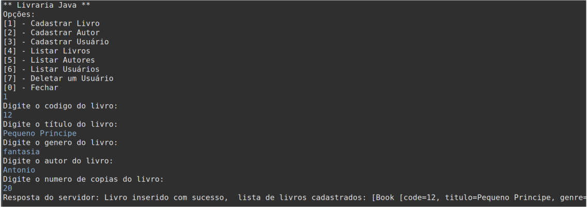
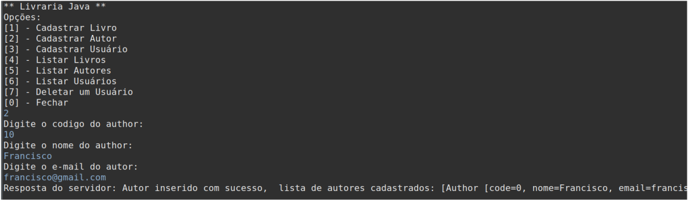
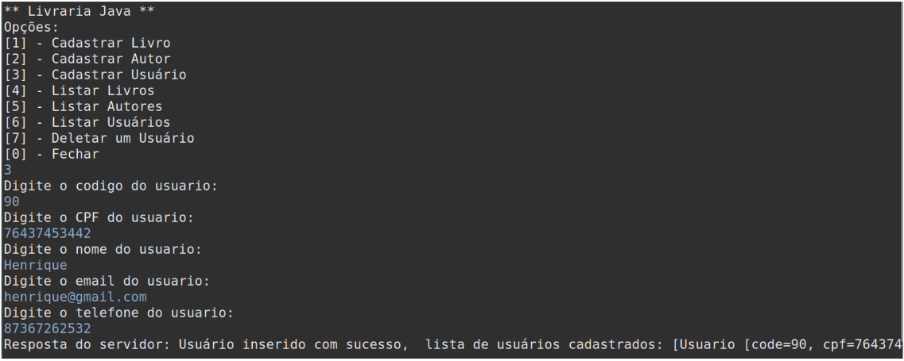
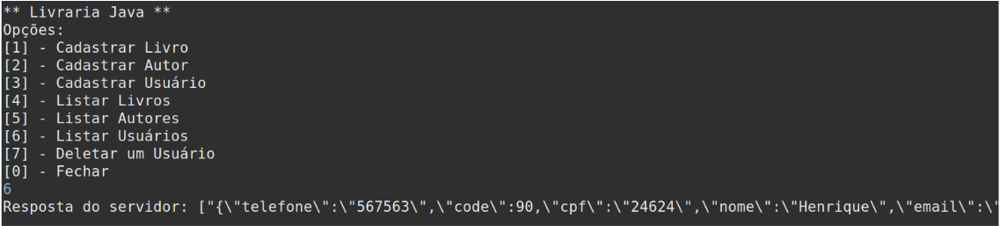
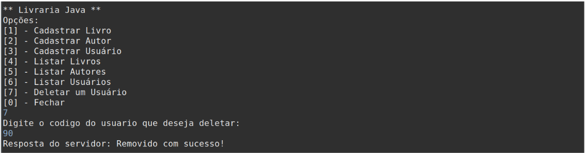
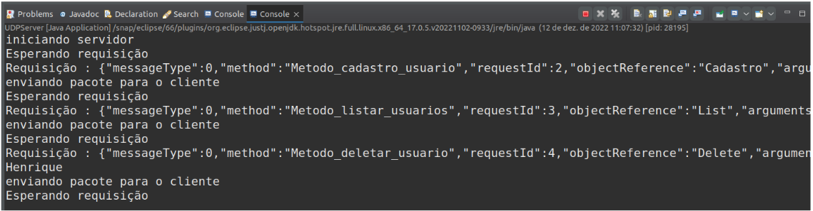

# Sistema Bibliotecário

## Visão geral do serviço remoto
O Sistema Bibliotecário tem como objetivo auxiliar no gerenciamento de cadastro de livros, cadastro de autores, cadastro de usuários, listar todos os autores cadastrados, livros e usuários. O sistema contará também com a remoção e edição de autores, livros e usuários. Por fim, contaremos também com a operação de realizar empréstimos de livros dentro do sistema. Dessa forma,
essas funções possibilitam que os funcionários da biblioteca tenham um controle sobre todas as informações dos livros disponíveis na biblioteca e quais os usuários foram cadastrados.

## Descrição dos Métodos Remotos - Implementados

* **Cadastro de usuário:** Realiza o cadastro de usuário dentro do sistema
bibliotecário, fornecendo os seguintes dados: code, CPF, name, e-mail e
telefone.
* **Cadastro de livro:** Realiza o cadastro de livros dentro do sistema
bibliotecário, fornecendo os seguintes dados: code, genre, author e
num_copies.
* **Cadastro de autor:** Realiza o cadastro de autores que poderão ser
utilizados no cadastro de um livro, fornecendo os seguintes dados: code,
name e email.
* **Listar livros:** Lista todos os livros cadastrados dentro do sistema.
* **Listar autores:** Lista todos os autores cadastrados dentro do sistema.
* **Deletar usuário:** Deletar os usuários cadastrados dentro do sistema.

## Descrição dos Dados transmitidos

Os dados saem da classe principal em forma de um objeto, depois chega na classe *Proxy*, na qual chamamos nosso método *doOperation* para estarmos passando os parâmetros do serviço remoto à ser executado para tipo *Byte*, assim realizando o empacotamento da mensagem com as seguintes informações: *idRequest*, objeto de referência do método e os argumentos do
objeto.
 
Com esses dados, é acionado o nosso *Despachante*, que irá invocar os métodos remotos que forem acionados,
e só assim realizar a conversão do nosso objeto para formato Json, dentro das classes do pacote *server.skeleton*, 
na qual irá repassar esses dados para o pacote *server.servant* e estar realizando, por exemplo, a operação cadastrar
um usuário. Com a requisição finalizada na parte do servidor, será emitida uma mensagem de confirmação de tarefa bem sucedida ou não. Um outro ponto importante nesta questão de transmissão, são que todos os dados que serão transmitidos entre Cliente e Servidor serão de forma serializada.

## Descrição das classes implementadas no lado Cliente e Servidor

**CLIENTE:** 

**UDPClient:** Na classe Client, implementamos os métodos sendRequest e getReplay, que são responsáveis por enviar algumas informações, como:
Requisição solicitada em forma de bytes, informações de conexão do cliente, como IP e Porta, do cliente para o servidor e receber a requisição
de resposta do servidor, respectivamente, usando sockets e datagramas UDP.

**Proxy:** A classe Proxy do lado cliente possui métodos idênticos aos presentes no lado servidor. Dessa forma, na visão do cliente,
as requisições são feitas de maneira local. Assim, o cliente não tem conhecimento de que as requisições são passadas a um servidor
remoto através da rede.

**SERVIDOR:** 

**UDPServer:** Recebe a mensagem serializada do Proxy Cliente. Após desserilizar a mensagem, esta é passada para o despachante. Ao
receber a resposta do Servente esta é empacotada e enviada para o Proxy Cliente, através da rede.

**Despachante:** Essa classe recebe a requisição do UDPServer e seleciona no esqueleto o método solicitado.

**Esqueleto:** Nessa classe, são implementados os métodos disponíveis pelo serviço. Como já dito anteriormente, esses métodos estão
acessíveis para o Cliente na classe Proxy. O esqueleto recebe os argumentos passados pelo despachante, invoca o método selecionado
na classe Servente e empacota a resposta recebida do servente.

**Servente:** Nessa classe é onde os métodos são realmente executados. Ao receber a requisição de algum dos métodos de cadastro, ele cria um
novo objeto na classe referente ao método com os argumentos passados pelo esqueleto.

## Modelo de falhas

O UDPServer não estabelece uma conexão com UDPClient ou vice-versa e assim impossibilita a comunicação entre si.
**packedReply** - Pode ocorrer do usuário, por exemplo, tentar colocar o nome do livro no campo código do livro,
assim, o servidor irá realizar uma nova tentativa, contando no máximo 3 vezes.

## **Operação Cadastro Livro**

## **Operação Cadastro Autor**

## **Operação Cadastro Usuário**

## **Operação Listar Usuário**

## **Operação Deletar Usuário**

## **Conexão Cliente Servidor e informações JSON**

